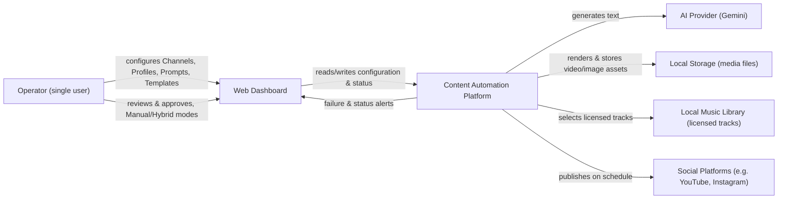

# 01 — Vision and Scope

**Status:** Draft — pending approval
**Version:** 1.1
**Last revised:** 2026-07-04
**Owning document for:** Product vision, product scope, product goals, product boundaries, product philosophy, product success criteria.
**Does not own:** Any technical architecture decision (owned by `04-system-architecture.md` onward), any terminology definition (owned by `00-glossary.md`), any constitutional/frozen decision (owned by `PROJECT_DECISIONS.md`), any technical planning assumption (owned by whichever later document governs the relevant subsystem). Where this document touches those subjects, it references them rather than restating them.

---

## 1. Purpose of This Document

This document answers three questions, and only three: **why does this product exist, what must it do in v1, and what must it deliberately not do in v1.** Every requirement in `02-product-requirements-prd.md` and every technical decision from `03-technical-requirements.md` onward must trace back to something stated here. If a future document proposes a capability that cannot be justified by a goal in Section 5, that capability is scope creep and must be rejected or escalated for explicit approval — not quietly absorbed.

This document does not describe *how* the system will be built. No database schema, no API shape, no queue topology, no framework choice, and no technical planning assumption appears here. Those belong to their owning documents later in the set.

---

## 2. Vision Statement

This platform is a modular **Content Automation Platform** for generating, managing, rendering, and publishing AI-assisted short-form content through reusable, configurable content pipelines. Its product identity is not "a tool one person uses to post videos" — it is a system in which content *behavior* (what gets generated, how it looks, how it is branded, what accompanies it, and where it is published) is defined once as reusable configuration — Content Profiles, Prompts, Templates, Content Types (see `00-glossary.md`) — and then operated repeatedly, predictably, and consistently across many Channels, without bespoke work per piece of content.

Version 1 intentionally narrows this vision to a single operator working within a single Workspace (PROJECT_DECISIONS.md, Section 1, Section 26). That narrowing is an implementation strategy for the current phase, not a ceiling on the product's ambition: the underlying scoping model, configuration entities, and pipeline architecture are built so that supporting additional operators, organizations, and eventually a broader SaaS offering is a natural evolution of the same platform rather than a rewrite of it. Section 14 (Future Vision) describes the directions that evolution could plausibly take, without committing to any of them.

---

## 3. Problem Statement

Producing short-form, branded content — quote cards, Shayari, festival wishes, and similar text-driven video formats — on a consistent publishing schedule is repetitive, inconsistent, and time-consuming when done manually. Every piece requires the same recurring set of decisions: what to say, how it should look, what tone and branding it should carry, what music fits it, and where and when it should be published. Doing this by hand does not scale with the cadence short-form content demands, and manual repetition introduces exactly the kind of inconsistency — mismatched branding, duplicate content, missed schedule slots, forgotten captions — that erodes an audience's trust in a channel's output.

This category of work is well suited to automation precisely because the variability that matters (the specific words, the specific artwork) can be generated fresh each time, while the variability that should *not* exist (branding, formatting, platform rules, scheduling discipline) can be fixed once as configuration and applied consistently on every run. What automation must not remove is editorial control: the person responsible for a Channel must still be able to decide how much of the pipeline runs unattended and how much requires a human checkpoint before anything is published (Automation Modes — PROJECT_DECISIONS.md, Section 16).

This platform exists to replace ad hoc, manual content production with a repeatable pipeline that is configured once and operated continuously — while keeping human judgment in the loop wherever it is wanted, and without introducing operational cost or complexity disproportionate to the value produced (PROJECT_DECISIONS.md, Section 2, Development Philosophy).

---

## 4. Product Principles

These principles describe the philosophy the product is designed around — the "why" behind the goals, constraints, and MVP definition that follow. They are product-level principles, distinct from the engineering-level Development Philosophy and Core Principles already frozen in PROJECT_DECISIONS.md (Sections 2 and 33), which this document references in Section 11 rather than restates. Where a future document faces an ambiguous *product* decision — not a technical one — these principles are the tiebreaker.

**Automation should reduce repetitive work, not remove user control.** The platform automates the mechanical, repeatable parts of content production — text generation, rendering, scheduling, publishing — but never removes the operator's ability to intervene. Automation Modes (PROJECT_DECISIONS.md, Section 16) exist specifically so that a fully unattended pipeline is a choice the operator makes deliberately, per Channel, rather than a default the platform imposes. A platform that automates a step the operator did not ask to hand over has failed this principle even when its output is technically correct.

**Configuration over code.** Every piece of recurring content behavior — what gets generated, how it looks, how it is branded, what music accompanies it, which platform rules apply — is expressed as configuration data (Content Profiles, Prompts, Templates, Content Types, Feature Flags, System Configuration; PROJECT_DECISIONS.md, Sections 10–13, 20–21) rather than as a code change. This is what makes the platform operable by someone who is not a developer, and what lets the same pipeline serve a new content idea without a deployment.

**Reusable content components, never one-off assets.** Prompts, Templates, and Content Profiles are designed to be referenced by many Channels, not authored per Channel (PROJECT_DECISIONS.md, Sections 11–13). A content idea that only works for one Channel is a signal that the configuration model needs a new reusable component, not a signal to build a one-off exception.

**Consistent branding by construction, not by discipline.** Because branding, watermarking, and rendering rules live in a Content Profile rather than being applied ad hoc per video, brand consistency is a property of the configuration itself, not something the operator has to remember to enforce every time. This removes an entire category of human error the manual workflow was exposed to.

**Predictable behavior over clever behavior.** Given the same Content Profile, Prompt Version, and Template Version, the platform behaves the same way every time it runs (PROJECT_DECISIONS.md, Sections 12.1, 13.1). The platform favors deterministic, explainable pipeline behavior over adaptive or "smart" behavior that would make a given day's output harder to predict or reproduce.

**Low operational cost as a first-class design constraint, not an afterthought.** Cost-consciousness is not a budget target layered on top of the design — it directly shapes which capabilities belong in a given phase (PROJECT_DECISIONS.md, Section 1, Section 33, Principles 1–2). A capability that only makes sense at a cost the current phase cannot justify is deferred, not built and hoped to become affordable later.

**Human approval available wherever it is wanted.** Whether a given Channel actually uses a human checkpoint is a per-Channel choice (Hybrid mode — PROJECT_DECISIONS.md, Section 16); that the *capability* to require one exists throughout the pipeline is not optional. No Channel can be published fully automatically unless the operator explicitly chose that.

---

## 5. Goals (v1)

These are the only goals v1 is accountable for. Each is stated as an outcome, not a feature list — the corresponding features are specified in `02-product-requirements-prd.md`.

| # | Goal | Why it matters |
|---|---|---|
| G1 | Generate original text content (quotes, Shayari, festival wishes, etc.) via an AI Provider, without ever fabricating a real-person attribution (PROJECT_DECISIONS.md, Section 3). | Attribution fabrication is a legal and reputational liability the platform must never introduce, even accidentally. |
| G2 | Render that text into a short vertical video using a fixed, repeatable pipeline (PROJECT_DECISIONS.md, Section 7, 7.1), correctly across English, Hindi, and Urdu scripts (PROJECT_DECISIONS.md, Section 8). | Correct multi-script rendering (Nastaliq, Devanagari) is the hardest part of this domain to get right after the fact; it must be correct from v1. |
| G3 | Publish that video to one or more configured social platforms on a schedule, at a target combined volume of 2–4 videos/day (PROJECT_DECISIONS.md, Section 4). | This is the actual value delivered: content appearing on the operator's channels without the operator manually uploading it. |
| G4 | Let the operator choose, per Channel, how much human checkpoint exists in that process — full manual review, full automatic publish, or hold-for-approval (PROJECT_DECISIONS.md, Section 16). | Trust in full automation is earned gradually; the operator must be able to dial control up or down per channel without redeploying anything. |
| G5 | Make every failure visible and attributable to a specific stage, never silent (PROJECT_DECISIONS.md, Section 33, Principle 6). | A one-person operation has no on-call team; if a job fails silently, the operator finds out only when a scheduled post never appears — days too late to matter. |
| G6 | Keep ongoing operational cost as close to zero as reasonably possible without compromising the goals above (PROJECT_DECISIONS.md, Section 1, Section 33). | The platform must remain viable for a single operator's budget indefinitely, not just during a pilot phase. |
| G7 | Build the data model and scoping (Workspace — PROJECT_DECISIONS.md, Section 26) so that supporting more than one operator later is a configuration change, not a rewrite — while building none of the billing, multi-user, or organization functionality that would actually require in v1. | The stated long-term intent is SaaS-readiness (PROJECT_DECISIONS.md, Section 1); paying that cost at the schema level now is cheap, paying it later as a migration is not — but building the rest of multi-tenancy now would violate Goal G6 and the Development Philosophy's cost/complexity ordering. |

---

## 6. Non-Goals / Out of Scope (v1)

Stating these explicitly prevents them from being quietly implemented as "obviously needed" during later documents or implementation. Anything on this list requires an explicit, approved revision to this document before it can be built.

- **Billing, subscriptions, organizations, or any multi-tenant business logic.** Only the schema-level Workspace scoping needed for future SaaS conversion is in scope (PROJECT_DECISIONS.md, Section 1, Section 26).
- **A second human user, editor, or assistant account.** v1 has exactly one operator (PROJECT_DECISIONS.md, Section 1).
- **General-purpose video editing.** No arbitrary video import, trimming, multi-clip editing, or effects beyond the fixed rendering pipeline (PROJECT_DECISIONS.md, Section 7.1).
- **Social media management features unrelated to this platform's own generated content** — no scheduling of externally-created posts, no inbox/comment management, no analytics dashboards beyond what's needed to track this platform's own publishing history.
- **Semantic duplicate detection, embeddings, or vector databases.** Only exact-match, normalized-hash duplicate detection is in scope (PROJECT_DECISIONS.md, Section 6).
- **AI provider fallback chains.** A single primary provider (Gemini) with retry-then-fail behavior is in scope; automatic failover to a second provider is not (PROJECT_DECISIONS.md, Section 5).
- **Kubernetes or any container orchestration platform.** Docker Compose only, for the lifetime of v1 (PROJECT_DECISIONS.md, Section 28).
- **Per-stage independent job scaling** (decomposing the Content Pipeline Job into separate Job Types). Explicitly anticipated as a possible future path, explicitly not authorized now (PROJECT_DECISIONS.md, Section 18.1).
- **Per-channel Content Profile forks or overrides.** A Channel references exactly one shared Content Profile; there is no mechanism to override part of a profile at the Channel level (PROJECT_DECISIONS.md, Section 11).
- **Languages beyond English, Hindi, and Urdu.** Additional languages are a future Content Profile configuration, not a v1 deliverable (PROJECT_DECISIONS.md, Section 8).

---

## 7. Project Constraints

A constraint, in this document, is a boundary condition imposed on Version 1 by the environment, budget, or maturity of the project — distinct from a Non-Goal (Section 6), which is a capability deliberately excluded from this phase's *product scope*. A constraint can be lifted in a future phase without changing the product vision; a Non-Goal simply is not being built yet. Separating the two makes clear which limitations are "not now" (constraints, likely to relax over time) versus "not in this product shape" (non-goals, a scope decision).

**Single operator.** Version 1 is built for exactly one operator within one Workspace (PROJECT_DECISIONS.md, Section 1). This exists because the platform has not yet been validated at any scale, and building multi-operator collaboration, permissions, or conflict-resolution logic before the single-operator workflow is proven would be solving a problem that doesn't exist yet.

**Local-first deployment.** The platform runs via Docker Compose, first on a local machine, then on a single VPS host, with no container orchestration platform in this phase (PROJECT_DECISIONS.md, Section 28). This exists because FFmpeg- and Playwright-based rendering requires persistent, long-running processes, and orchestration complexity has no justified benefit at v1's operating scale — it would add operational burden without adding capability.

**Low publishing volume.** Target volume is 2–4 published videos/day combined across all Channels, with a known external ceiling of roughly 6/day before a YouTube API quota increase is required (PROJECT_DECISIONS.md, Section 4). This exists because it matches what a single operator can meaningfully configure, review, and be accountable for, and because it keeps AI Provider and rendering costs predictable.

**Official platform APIs only.** All publishing integrations use each platform's official, sanctioned API (Publishing Adapters — PROJECT_DECISIONS.md, Section 22, Section 25). This exists because unofficial or scraped integration paths carry account-suspension risk that would undermine the entire purpose of a *reliable* automation platform, and because official APIs are the only integration path with a stable contract a Publishing Adapter can be built against.

**Cost-sensitive architecture.** Every architectural choice is evaluated against operational cost, not just technical merit (PROJECT_DECISIONS.md, Section 33, Principles 1–3). This exists because the platform must remain viable indefinitely on a single operator's budget, not just survive a pilot phase.

**Limited AI usage.** A single AI Provider (Gemini) is used, with retry-then-fail behavior and no automatic multi-provider fallback (PROJECT_DECISIONS.md, Section 5). This exists because provider-fallback logic adds meaningful complexity (response-shape normalization, cost/quality trade-offs across providers) that isn't justified until a single-provider failure rate is actually observed to be a problem.

---

## 8. Minimum Viable Product (MVP)

This section defines what Version 1 must be able to *do*, from the operator's perspective, before it is considered complete. It is a capability checklist, not an implementation plan — how each capability is built is owned by `03-technical-requirements.md` onward. A capability listed here without a corresponding functional requirement in `02-product-requirements-prd.md` is a documentation gap; a functional requirement in that document without a corresponding capability here is scope creep and must be justified against Section 5's goals or rejected.

Version 1 is complete when an operator can, entirely through the platform:

- **Manage Channels** — create, configure, and disable a Channel, each bound to one Content Profile, one or more Platform Connections, a Schedule, and an Automation Mode (PROJECT_DECISIONS.md, Section 14).
- **Manage Content Profiles** — create and configure a Content Profile referencing a pinned Prompt Version, pinned Template Version, Content Type, Language, and the branding/caption/hashtag/music rules that make its output consistent (PROJECT_DECISIONS.md, Section 11).
- **Manage a Prompt Library** — create, version, and roll back Prompts, with every Content Profile pinned to a specific version rather than tracking "latest" (PROJECT_DECISIONS.md, Section 12).
- **Manage a Template Library** — create, version, and roll back image rendering Templates, with the same pinning discipline as Prompts (PROJECT_DECISIONS.md, Section 13).
- **Generate and render content** — produce text via the AI Provider, validate it, render it into a short vertical video with attached music, for English, Hindi, and Urdu (PROJECT_DECISIONS.md, Section 6, Section 7, Section 8).
- **Schedule publishing** — define when a Channel's content is generated and published, with schedule state surviving process restarts (PROJECT_DECISIONS.md, Section 17).
- **Choose an Automation Mode per Channel** — Manual, Automatic, or Hybrid, exactly as frozen in PROJECT_DECISIONS.md, Section 16.
- **Publish to real platforms** — through official Publishing Adapters honoring each platform's own limits (PROJECT_DECISIONS.md, Section 22).
- **Review Publishing History** — see what was published, when, to where, and its outcome.
- **Receive failure and status Notifications** — driven by Domain Events, attributed to a specific pipeline Stage with a Reason, Retry Count, and Timestamp (PROJECT_DECISIONS.md, Section 23, Section 24, Section 33 Principle 6).
- **View system Logs** — as a distinct Dashboard Module from Publishing History and Notifications (PROJECT_DECISIONS.md, Section 30).
- **Operate all of the above through the frozen Dashboard Modules** (PROJECT_DECISIONS.md, Section 30) — no capability in this list depends on direct API or database access.

Version 1 is explicitly **not** required to do anything listed in Section 6 (Non-Goals) to be considered complete.

---

## 9. Target User & Usage Context

**Primary user:** a single operator who owns the one v1 Workspace, configures Content Profiles and Channels, sets Automation Mode per Channel, and reviews/approves content under Manual or Hybrid mode.

The operator is expected to be comfortable operating a web dashboard but is not assumed to be a developer — the product experience does not require reading code or interacting with the database directly. Day-to-day operation happens through the Dashboard (PROJECT_DECISIONS.md, Section 30); direct API access (Section 29, API Versioning) exists to support future integrations and automation, not as the primary way the operator interacts with the platform day to day.

**Usage cadence:** Configuration (Content Profiles, Prompts, Templates, Channels) happens relatively infrequently — setup-heavy, then largely stable. Day-to-day interaction is lighter: reviewing Hybrid-mode approvals, checking Publishing History, and responding to Notifications about failures or expiring tokens.

---

## 10. Success Criteria

Success for v1 is defined operationally, not aspirationally — each criterion below is verifiable after deployment:

1. The platform sustains the target publishing volume (2–4 videos/day combined, PROJECT_DECISIONS.md, Section 4) for at least one continuous month without manual workarounds outside the documented Automation Modes.
2. No published piece of content contains a fabricated real-person attribution (Section 3 of PROJECT_DECISIONS.md) — zero tolerance, not a rate target.
3. No exact-duplicate content is published — enforced by the validation pipeline (PROJECT_DECISIONS.md, Section 6), not by manual review.
4. Every job failure is visible to the operator (via Notifications, PROJECT_DECISIONS.md, Section 24) within a reasonable time of occurring, with enough attributed detail (Stage, Reason, Retry Count, Timestamp) to diagnose it without reading logs.
5. Adding a new Content Profile, Prompt, or Template — using existing infrastructure — requires configuration through the dashboard, not a code change or deployment.
6. Monthly infrastructure cost remains consistent with a single-operator budget: local/VPS Docker Compose hosting plus AI Provider usage costs, with no paid service introduced that does not clear the bar in PROJECT_DECISIONS.md, Section 33, Principle 2.

---

## 11. Guiding Principles

This document does not restate the Development Philosophy (PROJECT_DECISIONS.md, Section 2) or the Core Principles (PROJECT_DECISIONS.md, Section 33) — they apply here in full and govern every trade-off in this document, including the scope boundaries in Section 6 and the constraints in Section 7 above. Where a goal in Section 5 appears to conflict with those principles (for example, Goal G7's SaaS-readiness against Section 2's cost/complexity ordering), the resolution is stated inline in that goal's rationale rather than left implicit.

---

## 12. System Context (High-Level)

The diagram below shows the platform's position relative to external actors and systems. It is intentionally shallow — it names *what* the system talks to, not *how* (queue topology, database choice, and internal module boundaries are owned by `04-system-architecture.md` onward).

This diagram deliberately omits the job queue, worker processes, and database — those are internal implementation structure, not system context, and are specified starting in `04-system-architecture.md`.

---

## 13. Relationship to Other Documents

- **`PROJECT_DECISIONS.md`** — the constitution. Every goal, non-goal, constraint, MVP item, and success criterion above is traceable to a section there; none contradicts it.
- **`00-glossary.md`** — every capitalized term used above (Workspace, Channel, Content Profile, Automation Mode, Job, Notification, etc.) is defined there, not here.
- **`02-product-requirements-prd.md`** (next) — translates the goals in Section 5 and the MVP in Section 8 into concrete, testable functional requirements. It must not introduce a requirement that cannot be traced to a goal or MVP item here, and must not silently expand a non-goal in Section 6.
- **`03-technical-requirements.md`** onward — own all technical "how" decisions, and all technical planning assumptions. This document owns none.

---

## 14. Future Vision (Product Roadmap Directions)

Version 1 is deliberately narrow (Section 7, Project Constraints). This section describes directions the product could plausibly grow into, consistent with the long-term vision in Section 2 — without committing to any of them. None of the following is authorized for implementation; each would require its own explicitly approved revision to PROJECT_DECISIONS.md and a corresponding documentation update before work begins (PROJECT_DECISIONS.md preamble; Section 34, Open Items).

- **Multiple Workspaces.** The schema-level scoping already exists (PROJECT_DECISIONS.md, Section 26); activating a second Workspace is a plausible near-term direction once the single-operator workflow is proven, but the operational and support burden of running two operators' pipelines concurrently has not been assessed.
- **Organizations and team collaboration.** Multiple human users sharing a Workspace, with permissions and roles, is a plausible direction once a single operator's needs are well understood — v1 deliberately defers all multi-user logic (Section 6, Non-Goals).
- **Billing and subscriptions.** Necessary only if the platform is offered to operators beyond its original owner; explicitly out of scope until that decision is made (PROJECT_DECISIONS.md, Section 1, Section 26).
- **A public API surface.** The versioned API foundation (PROJECT_DECISIONS.md, Section 29) already anticipates external consumers; a documented, supported public API is a plausible future offering built on that foundation, not a v1 deliverable.
- **A marketplace for Prompts, Templates, or Content Profiles.** Because these are already first-class, versioned, reusable entities (Sections 12–13), a future marketplace for sharing or trading them across Workspaces is architecturally plausible without redesigning those entities — but is a product decision, not a current one.
- **Additional AI Providers.** The provider adapter interface (PROJECT_DECISIONS.md, Section 5) already anticipates more than one implementation; adding a second provider, or automatic fallback between providers, is a plausible direction once the single-provider retry-then-fail behavior proves insufficient.
- **Additional publishing platforms.** The Publishing Adapter pattern (Sections 22, 25) is designed to add a platform by adding an adapter, not by changing the pipeline — new platforms are a natural extension as demand justifies them.
- **Advanced analytics.** Beyond the Publishing History required for v1 (Section 8, MVP), deeper performance analytics (engagement, reach, trend detection) is a plausible future capability once there is enough publishing history to analyze meaningfully.
- **A plugin architecture.** Allowing third-party or custom pipeline stages, validators, or renderers is a plausible long-term direction if the platform's own maintainers outgrow what a fixed pipeline (PROJECT_DECISIONS.md, Section 7) can offer — but it is a significant architectural commitment, not a near-term one.
- **Custom rendering engines.** The React/Playwright/FFmpeg pipeline (PROJECT_DECISIONS.md, Section 7.1) is frozen for v1; supporting alternative rendering engines per Content Profile is conceivable once the current pipeline's limitations are actually felt, not before.

None of the items above is a roadmap commitment, a prioritized backlog, or an implicit approval to begin design work. They exist so that later architectural choices (for example, how a Provider adapter interface is shaped) can be made with awareness of plausible future directions, without building for any of them prematurely (PROJECT_DECISIONS.md, Section 2, Development Philosophy).

If publishing volume ever needs to exceed the ~6 uploads/day YouTube Data API v3 ceiling noted in PROJECT_DECISIONS.md, Section 4, a quota-increase request to Google has lead time and should be initiated well before that volume goal is raised. This is an operational note, not a roadmap item, but it is recorded here because it is a real constraint on how far "additional publishing platforms" or "higher volume" can go without external action.

---

## Document Control

**Note on assumptions:** This document intentionally contains no assumptions register and no technical planning assumptions. Vision and Scope defines product direction; open technical questions — for example, the specific latency target for failure Notifications, or the exact boundary of what the Dashboard must expose versus what remains API-only — belong to whichever later document owns that subsystem (`03-technical-requirements.md`, `04-system-architecture.md`, `07-frontend-architecture.md`, or `09-ai-content-engine.md`, as applicable) and should be raised there, not carried forward from here.

**Consistency self-review performed against PROJECT_DECISIONS.md and 00-glossary.md:**

- Every capitalized domain term used above matches its glossary definition exactly; none is redefined or paraphrased here.
- Every non-goal in Section 6 and every constraint in Section 7 corresponds to something explicitly stated, excluded, or deferred in PROJECT_DECISIONS.md; none was invented.
- The new Product Principles (Section 4) are stated as product-level philosophy, distinct from and non-duplicative of the engineering-level Development Philosophy (Section 2) and Core Principles (Section 33) already frozen in PROJECT_DECISIONS.md, which are referenced rather than restated.
- The MVP (Section 8) lists only product capabilities, with no implementation detail, and is fully traceable to Goals (Section 5) and to PROJECT_DECISIONS.md.
- The expanded Future Vision (Section 14) is explicitly framed as non-committal possibilities, consistent with PROJECT_DECISIONS.md's requirement that any such direction requires a future approved revision before implementation.
- All prior technical-planning assumptions (the former A1–A3) have been removed; their underlying product-relevant content was either restated as plain product description (Target User, Section 9) or left as-is without a hedge (Success Criteria, Section 10), and a forward-pointing note replaces the removed register.
- Section numbering was updated throughout to accommodate the three new sections; no previously-approved section's substantive content was altered beyond the specific items requested (Vision, Problem Statement, Target User's assumption framing, Success Criteria's assumption note, and Future Considerations' expansion).

**No contradictions with PROJECT_DECISIONS.md or 00-glossary.md were found.**

**This document remains a draft pending your approval — not yet frozen.** Waiting for review before generating `02-product-requirements-prd.md`.
