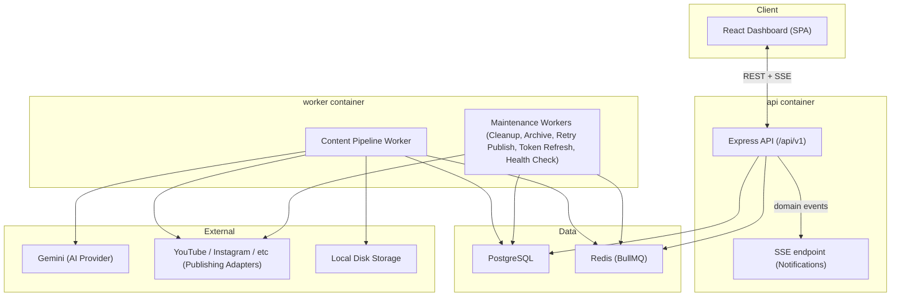
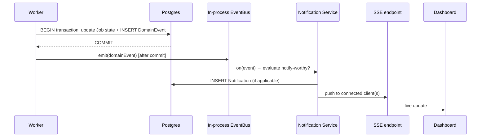
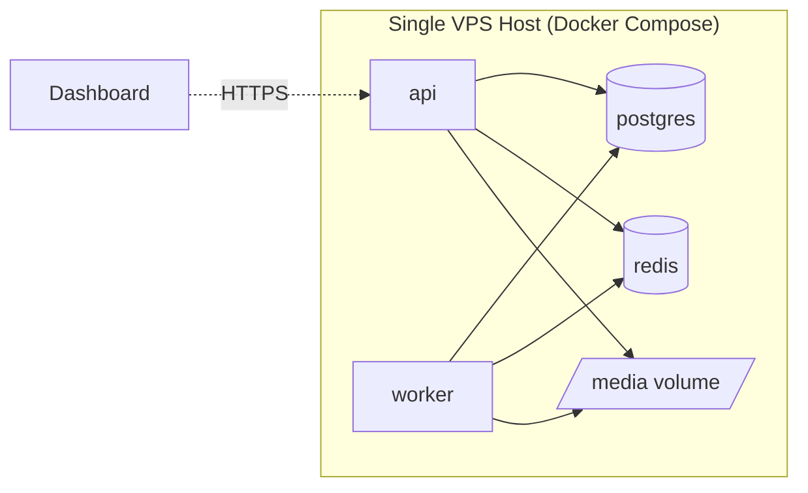

# 04 — System Architecture

**Status:** Draft — pending approval
**Version:** 1.0
**Last revised:** 2026-07-04
**Owning document for:** Component topology, process/container boundaries, queue/worker topology, the Content Pipeline Job's execution model, Domain Event and Notification mechanics, deployment shape.
**Does not own:** Technology selection rationale (`03-technical-requirements.md`), schema (`05-database-design.md`), internal backend folder/module structure (`06-backend-architecture.md`), UI structure (`07-frontend-architecture.md`), or any frozen decision (`PROJECT_DECISIONS.md`).

---

## 1. Component Overview



Two Node.js processes share one codebase and one `dist/` build: **`api`** (Express, serves the Dashboard's REST calls and the Notification SSE stream) and **`worker`** (BullMQ workers; no HTTP surface at all). This is a monolith split into two processes only where it must be — a worker needs to run continuously and independently of HTTP traffic — not a microservices decomposition. Both processes talk to the same Postgres and Redis instances.

---

## 2. Queue & Worker Topology

Per `03-technical-requirements.md` and `PROJECT_DECISIONS.md` Section 18, there are **six BullMQ queues**, one per Job Type:

| Queue | Job Type | Concurrency | Notes |
|---|---|---|---|
| `content-pipeline` | Content Pipeline Job (Section 18.1) | From System Configuration (default 2, matching Section 7.1's render-concurrency guidance) | The only queue whose jobs pass through the 13-state machine (Section 19). |
| `cleanup` | Cleanup | 1 | Housekeeping, not latency-sensitive. |
| `archive` | Archive | 1 | Same. |
| `retry-publish` | Retry Publish | 2 | Independent of the pipeline queue so a publish retry storm never starves new content generation. |
| `token-refresh` | Token Refresh | 1 | Scheduled ahead of Platform Connection token expiry. |
| `health-check` | Health Check | 1 | Periodic repeatable job. |

**Why six queues instead of one queue with a `jobType` discriminator column:** separate queues give each Job Type its own concurrency and backoff configuration for free, using BullMQ's own mechanism — no custom router needed. This is the simpler option, not the more "enterprise" one; a single shared queue would require building exactly the kind of per-type dispatch logic BullMQ already provides natively per-queue.

### 2.1 Content Pipeline Job execution model

One BullMQ job = one Content Pipeline Job record = one pass through all 13 states (`PROJECT_DECISIONS.md` Section 19). The worker's processor function is a single sequential function, not a state-machine library — each stage is a plain `async` step:

```
processContentPipelineJob(job):
  1. loadJobAndChannelConfig(job.data.jobId)
  2. if resuming (see 2.2) → skip to first incomplete stage
  3. for each stage in [Generating Content ... Publishing]:
       a. update Job.pipelineStage = stage, persist, emit Domain Event
       b. run the stage's actual work (call a Service, never inline business logic in the worker — Section 25)
       c. persist the stage's output onto the Job / GeneratedContent record (see 05-database-design.md)
       d. on failure: record Stage/Reason/RetryCount/Timestamp, set status Failed, emit Domain Event, stop
  4. mark Published, emit Domain Event
```

This is exactly the "no saga/coordinator layer" design `PROJECT_DECISIONS.md` Section 18.1 calls for: BullMQ's own retry/backoff handles job-level retry; stage-level progression is plain sequential code inside one job's execution, not a second orchestration layer on top of BullMQ.

### 2.2 Restart-from-failed-stage (resolves A-13, restart half)

When the operator triggers Retry on a Failed pipeline Job (FR-JOB-02/FR-JOB-06), a **new BullMQ job** is enqueued referencing the *same* Job row (not a new Job row) — `processContentPipelineJob` detects that intermediate outputs already exist for stages before the failed one and skips straight to the failed stage, provided the Content Profile / Prompt Version / Template Version pinned at original-attempt time still match the Channel's current pins (persisted as a `configSnapshot` JSON field on the Job at Draft time). A mismatch forces the retry to run from `Draft` instead — this comparison lives in a Service, not scattered across the worker function.

### 2.3 Pause/Resume — not implemented

Per `03-technical-requirements.md` A-13, no pause/resume mechanism exists. A Channel can be disabled (FR-CHN-02) to stop *future* jobs; an in-flight job always runs to completion or failure. This is a deliberate absence, not an oversight — do not add a `PATCH /jobs/:id/pause` route without first revisiting `03-technical-requirements.md`'s reasoning.

---

## 3. Domain Events & Notifications



- A Domain Event is **always** written in the same DB transaction as the state change it represents (`03-technical-requirements.md` Section 3.2) — this is the single source of truth `PROJECT_DECISIONS.md` Section 23 requires.
- The in-process EventBus (a plain Node `EventEmitter`, one per process) is a **delivery mechanism**, not a second detection mechanism — it only ever fires after a Domain Event has already been durably committed. If the `worker` process crashes between commit and emit, the Notification is missed for that instant, but the Domain Event itself is not lost (it's in Postgres); a lightweight periodic reconciliation job (part of Health Check) sweeps for Domain Events with no corresponding Notification and backfills — this closes the only gap an in-process emitter has, without needing a message broker.
- The `api` process holds the SSE connections; since the EventBus is in-process, the `worker` process publishes Domain Events into Redis Pub/Sub (a channel BullMQ's Redis instance already provides, no new infrastructure) and the `api` process subscribes and re-emits to its local EventBus → SSE clients. This is the one place the two processes talk to each other outside the shared database.

---

## 4. Scheduling

Each Channel's Schedule (`PROJECT_DECISIONS.md` Section 17) is a BullMQ **repeatable job** on the `content-pipeline` queue, keyed by Channel ID. Creating/editing/disabling a Channel's schedule (FR-AUT-02, FR-CHN-02) directly adds/removes/updates the corresponding repeatable job definition via BullMQ's API — there is no separate scheduler process or cron layer, consistent with the Section 17 freeze (node-cron rejected).

---

## 5. Provider Layer

| Provider interface | v1 implementation(s) | Notes |
|---|---|---|
| `AIProviderAdapter` | `GeminiAdapter` | Returns structured JSON validated against a Zod schema (`PROJECT_DECISIONS.md` Section 5.1); on schema-validation failure, treated as a Generating Content stage failure, not silently retried with a different parse strategy. |
| `PublishingAdapter` | `YouTubeAdapter`, `InstagramAdapter` (added as demand justifies — `01-vision-and-scope.md` Section 14) | Each adapter owns its own Platform Limits (`PROJECT_DECISIONS.md` Section 22); the Publishing stage in the pipeline calls `adapter.publish(content)` and never branches on platform name itself. |
| `StorageProvider` | `LocalDiskStorageProvider` | Behind the same interface from day one so R2/S3 (`PROJECT_DECISIONS.md` Section 27) is a second implementation later, not a rewrite. |

All three interfaces live in the Providers layer (Section 25 Module Ownership) and are the **only** code permitted to make an external network call to Gemini, a social platform, or the filesystem.

---

## 6. Deployment Topology



- `docker-compose.yml` defines five services: `api`, `worker`, `postgres`, `redis`, and (production only) a thin reverse proxy (e.g., Caddy or nginx) for TLS termination — the proxy is the only new piece production adds over development.
- `api` and `worker` are built from the same Dockerfile/image; the only difference is the container command (`node dist/api.js` vs `node dist/worker.js`) — one build, two run modes, per `PROJECT_DECISIONS.md` Section 28's "same containers, VPS host" principle.
- Media (rendered PNGs/videos) live on a named Docker volume mounted into both `api` (to serve/preview) and `worker` (to write) — this is the concrete shape of the `LocalDiskStorageProvider`.
- No orchestration platform, no service mesh, no auto-scaling group — explicitly excluded (`PROJECT_DECISIONS.md` Section 28).

---

## 7. Failure Domains & Isolation

- A crash in `worker` never takes down `api` (separate containers, `restart: unless-stopped`) — the Dashboard stays reachable even mid-incident, which is exactly what Goal G5 (failure visibility) needs most.
- A stuck/slow Gemini call in one Content Pipeline Job cannot block another job on the same queue beyond the configured concurrency limit — BullMQ isolates job execution per worker slot.
- Redis is a single point of failure for both queueing and Pub/Sub notification delivery; at v1's scale (single VPS, single operator) an external managed Redis is not justified (Section 2 cost ordering) — Redis persistence (AOF) is enabled so a container restart doesn't silently drop in-flight repeatable-job schedules.

---

## 8. Consistency Check

This document assumes the resolutions in `03-technical-requirements.md` Section 4 (A-9, A-10, A-12, A-13) are accepted. It introduces no new architectural pattern beyond what `PROJECT_DECISIONS.md` already anticipates (Section 18.1's "Future path" paragraph explicitly anticipated per-stage decomposition being possible later without a schema redesign; this document does not perform that decomposition — it stays at "one job, sequential stages," per current authorization).

**No contradictions with `PROJECT_DECISIONS.md`, `00-glossary.md`, `01-vision-and-scope.md`, `02-product-requirements-prd.md`, or `03-technical-requirements.md` were introduced.**

**This document remains a draft pending your approval.**
