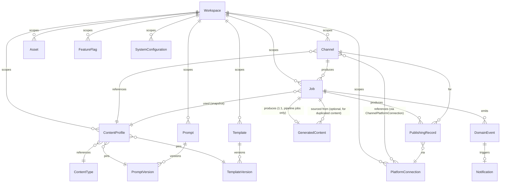

# 05 — Database Design

**Status:** Draft — pending approval
**Version:** 1.0
**Last revised:** 2026-07-04
**Owning document for:** Physical schema — tables, columns, types, relationships, indexes, enums. PostgreSQL via Prisma (`03-technical-requirements.md`, Section 2).
**Does not own:** Why Postgres/Prisma were chosen (`03-technical-requirements.md`), how Repositories wrap this schema in code (`06-backend-architecture.md`), or any product/business rule (owned by `PROJECT_DECISIONS.md` / `00-glossary.md` — this document implements those rules in tables, it does not reinterpret them).

---

## 1. Conventions

- Every table has `id` (UUID, PK), `createdAt`, `updatedAt` (Prisma `@default(now())` / `@updatedAt`) unless noted otherwise.
- Every table listed in `PROJECT_DECISIONS.md` Section 26 as Workspace-scoped carries a `workspaceId` FK — enforced even though v1 has exactly one Workspace row, per Section 26's "no retrofit needed later" requirement.
- Soft-delete (`03-technical-requirements.md`, A-3/A-4) is implemented as `status` enums (`Active` / `Deprecated` / `Disabled`) rather than a generic `deletedAt` — this makes "why can't I select this?" explicit in the same field that already carries lifecycle meaning, instead of adding a second implicit flag.
- All foreign keys are `RESTRICT` on delete by default (nothing in this schema hard-deletes a row another row depends on); the few exceptions are called out explicitly.

---

## 2. Entity-Relationship Overview



---

## 3. Core Configuration Tables

### 3.1 `Workspace`
```
id            UUID PK
name          String
createdAt, updatedAt
```
Exactly one row in v1 (`PROJECT_DECISIONS.md` Section 26). No delete path exists for this table in v1.

### 3.2 `ContentType`
```
id            UUID PK
workspaceId   FK -> Workspace
name          String            // "Shayari", "Motivational Quote", etc.
status        Enum(Active, Disabled)
createdAt, updatedAt
```
Seed data in v1 (per `03-technical-requirements.md`, A-2 remains open at the product level — the table supports operator-authored rows without any schema change if that's later approved; the API simply doesn't expose create/edit yet).

### 3.3 `Prompt` / `PromptVersion`
```
Prompt:
  id            UUID PK
  workspaceId   FK -> Workspace
  name          String
  status        Enum(Draft, Active, Deprecated)   // library-level default-offer status
  notes         Text NULL
  createdAt, updatedAt

PromptVersion:
  id            UUID PK
  promptId      FK -> Prompt
  versionNumber Int                                 // monotonic per Prompt, never reused
  body          Text                                // the actual prompt text/template
  status        Enum(Draft, Active, Deprecated)
  notes         Text NULL
  createdAt     DateTime                            // immutable once created (Section 12.1)
```
`PromptVersion` rows are **never updated** after creation except `status` and `notes` (Section 12.1's "existing versions are never mutated in place" applies to `body`, not to library metadata). Enforced at the Service layer (`06-backend-architecture.md`), not by a DB trigger — a trigger would be an abstraction this system doesn't need; a Service-layer guard plus a unique `(promptId, versionNumber)` constraint is sufficient and matches the "avoid unnecessary abstractions" principle.

### 3.4 `Template` / `TemplateVersion`
Structurally identical to 3.3, with `body` replaced by `componentPath` (String — location of the versioned React template source) or `componentSource` (Text, if templates are stored inline rather than as files — this exact choice is deferred to `06-backend-architecture.md` since it's an implementation, not a schema, question; either way the column is immutable per version, same rule as `PromptVersion.body`).

### 3.5 `Asset`
```
id             UUID PK
workspaceId    FK -> Workspace
type           Enum(Background, Font, Music, Logo, Watermark, Animation, Icon)
name           String
status         Enum(Active, Disabled)
filePath       String                    // StorageProvider-relative path
metadata       JSONB                     // type-specific fields, see below
licenseStatus  Enum(Confirmed, Unconfirmed) NULL   // required and enforced only when type = Music
createdAt, updatedAt
```
**Decision:** one `Asset` table with a `type` enum and a `metadata` JSONB column, not seven per-type tables. `metadata`'s shape is validated per `type` at the Service layer using a Zod discriminated union — this keeps the schema simple (Section 25/31 "avoid unnecessary abstractions") while still giving every type (Music: Mood/Language/Genre/Duration; Font: script coverage; etc.) its own validated shape in code. `licenseStatus` is a real column, not buried in `metadata`, because it's the one field with an actual hard business rule attached to it (FR-AST-02) — pulling it out of JSONB lets the DB index and query it directly.

### 3.6 `ContentProfile`
```
id                    UUID PK
workspaceId           FK -> Workspace
name                  String
status                Enum(Active, Disabled)
contentTypeId         FK -> ContentType
promptVersionId       FK -> PromptVersion        // pinned, never "latest"
templateVersionId     FK -> TemplateVersion       // pinned, never "latest"
language              Enum(English, Hindi, Urdu)
tone                  String
writingStyle          String
promptVariables       JSONB
brandingRules         JSONB
watermarkRules        JSONB
captionStrategy       JSONB
hashtagStrategy       JSONB
musicSelectionRules    JSONB
renderingConfiguration JSONB
validationRules       JSONB                       // additive constraints, Section 6.2
createdAt, updatedAt
```
No `category` free-text column exists anywhere — `PROJECT_DECISIONS.md` Section 10's conflict resolution is enforced structurally by `contentTypeId` being the only relevant field.

---

## 4. Channels, Platforms & Publishing

### 4.1 `Channel`
```
id                     UUID PK
workspaceId            FK -> Workspace
name                   String
contentProfileId       FK -> ContentProfile
automationMode         Enum(Manual, Automatic, Hybrid)
status                 Enum(Active, Disabled)
scheduleCron           String         // repeatable-job definition, mirrored into BullMQ (04-system-architecture.md, Section 4)
publishingConfiguration JSONB
createdAt, updatedAt
```

### 4.2 `PlatformConnection`
```
id                UUID PK
workspaceId       FK -> Workspace
platform          Enum(YouTube, Instagram, ...)
accessTokenEnc    Bytes         // application-level AES-GCM encrypted, never plaintext
refreshTokenEnc   Bytes
expiresAt         DateTime
scopes            String[]
healthStatus      Enum(Healthy, Unhealthy, Expired, Unknown)
createdAt, updatedAt
```

### 4.3 `ChannelPlatformConnection` (join table)
```
channelId            FK -> Channel
platformConnectionId FK -> PlatformConnection
PRIMARY KEY (channelId, platformConnectionId)
```
A Channel referencing "one or more" Platform Connections (`PROJECT_DECISIONS.md` Section 14) is a many-to-many, not a single FK column.

---

## 5. Jobs, Pipeline Output & Events

### 5.1 `Job`
```
id                      UUID PK
workspaceId             FK -> Workspace
jobType                 Enum(ContentPipeline, Cleanup, Archive, RetryPublish, TokenRefresh, HealthCheck)
channelId               FK -> Channel NULL          // NULL for non-pipeline maintenance jobs not tied to a Channel
contentProfileId        FK -> ContentProfile NULL
configSnapshot          JSONB NULL                  // {promptVersionId, templateVersionId} captured at Draft time — resolves A-13 restart consistency check
pipelineStage           Enum(Draft, GeneratingContent, Validating, GeneratingImage, GeneratingVideo,
                              SelectingMusic, GeneratingCaption, GeneratingHashtags, Queued, Publishing,
                              Published, Failed, Archived) NULL   // NULL for non-pipeline Job Types
maintenanceState        String NULL                 // simple state for Independent Job Types (Section 18.2), own smaller enum per type
failureStage            String NULL
failureReason           Text NULL
retryCount              Int DEFAULT 0
failedAt                DateTime NULL
generatedText           Text NULL                   // intermediate output, persisted after each successful stage
imageUrl                String NULL
videoUrl                String NULL
caption                 Text NULL
hashtags                JSONB NULL
createdAt, updatedAt
```
This is the **one table** that is intentionally "wide" — it doubles as both the execution record (Section 18/19) and the durable checkpoint store that makes restart-from-failed-stage (`03-technical-requirements.md`, A-13) possible. This is a deliberate trade-off, not sloppiness: splitting stage-checkpoint columns into a separate `JobStageOutput` table was considered and rejected because every one of those columns is 1:1 with the Job and is never queried independently of it — a second table would be a join for no benefit (Section 31, avoid unnecessary abstraction).

### 5.2 `GeneratedContent` (resolves A-10)
```
id                    UUID PK
workspaceId           FK -> Workspace
jobId                 FK -> Job UNIQUE            // 1:1 with the Content Pipeline Job that produced it
sourceGeneratedContentId FK -> GeneratedContent NULL  // set when this row originated via "duplicate" (A-12), never via regeneration (see below)
contentProfileId      FK -> ContentProfile
promptVersionId       FK -> PromptVersion
templateVersionId     FK -> TemplateVersion
language              Enum(English, Hindi, Urdu)
contentTypeId         FK -> ContentType
text                  Text
imageUrl              String NULL
videoUrl              String NULL
caption               Text NULL
hashtags              JSONB NULL
publishStatus         Enum(Unpublished, Published, PublishFailed)
createdAt, updatedAt
```
- FR-GC-06 (Regenerate) creates a **new** `GeneratedContent` row (and a new backing `Job`) with `sourceGeneratedContentId` pointing at the original — regeneration and duplication share this same lineage field; the distinction is only in whether the new Job actually calls the AI Provider again (regenerate) or copies `text` forward (duplicate, per A-12's unified mechanism). This is *tracking lineage*, not two different schema shapes.
- Deleting a `GeneratedContent` row (FR-GC-05) never deletes its `Job` row (`ON DELETE RESTRICT`, or the delete is simply blocked at the Service layer if `publishStatus = Published`, per FR-GC-05's stated rule).

### 5.3 `DomainEvent`
```
id           UUID PK
workspaceId  FK -> Workspace
jobId        FK -> Job NULL
type         String            // "ContentGenerated", "PublishFailed", etc. — Section 23's fixed vocabulary
payload      JSONB
createdAt    DateTime
```
Append-only, never updated. Written in the same transaction as the Job/state change it represents (`04-system-architecture.md`, Section 3).

### 5.4 `Notification`
```
id            UUID PK
workspaceId   FK -> Workspace
domainEventId FK -> DomainEvent           // every Notification traces to exactly one event, Section 24's requirement, enforced structurally
message       String
readAt        DateTime NULL
createdAt     DateTime
```

### 5.5 `PublishingRecord`
```
id                     UUID PK
workspaceId            FK -> Workspace
jobId                  FK -> Job
channelId              FK -> Channel
platformConnectionId   FK -> PlatformConnection
contentTypeSnapshot    String              // captured at publish time — resolves FR-PUB-03's edge case (filter survives later Content Profile edits)
status                 Enum(Success, Failure)
platformResponse       JSONB NULL
publishedAt            DateTime
```
One row per platform per attempt — a Channel with three Platform Connections and one Job produces up to three `PublishingRecord` rows, satisfying FR-PUB-01's "partial success recorded independently" requirement structurally, not via application-level bookkeeping.

---

## 6. Configuration & Flags

### 6.1 `FeatureFlag`
```
id           UUID PK
workspaceId  FK -> Workspace
key          String UNIQUE per workspace     // "enable_approval_mode", etc.
enabled      Boolean
description  String
```

### 6.2 `SystemConfiguration`
```
id           UUID PK
workspaceId  FK -> Workspace
key          String UNIQUE per workspace     // "retry_limit.generation", "render_concurrency", etc.
value        JSONB
```
Key-value rather than one column per setting — new configuration values (Section 21 explicitly anticipates more being added) require a seed-data insert, never a migration. This is the correct amount of flexibility for a table whose entire purpose is "avoid hardcoded constants" — a rigid columnar schema here would reintroduce the exact problem Section 21 exists to solve.

### 6.3 `Log`
```
id           UUID PK
workspaceId  FK -> Workspace
level        Enum(Debug, Info, Warn, Error)
message      Text
context      JSONB NULL
createdAt    DateTime
```
Populated by the log-drain described in `04-system-architecture.md`; indexed on `(createdAt)` and a `tsvector` generated column on `message` for Global Search (FR-NAV-04) if/when `LIKE` queries stop being fast enough (`03-technical-requirements.md`, Section 3.1).

---

## 7. Indexing Notes

- `Job(workspaceId, jobType, pipelineStage)` — composite index; every Queue/Job dashboard view (FR-QUE-01–04) filters on exactly this shape.
- `Job(channelId, createdAt)` — Channel-scoped Job history.
- `GeneratedContent(contentProfileId)`, `GeneratedContent(publishStatus)` — FR-GC-01's filter dimensions.
- `PublishingRecord(channelId, publishedAt)`, `PublishingRecord(status)`, `PublishingRecord(contentTypeSnapshot)` — the five FR-PUB-03 filter dimensions (Platform and Date Range are covered by `platformConnectionId`/`publishedAt` already present).
- `DomainEvent(jobId, createdAt)`, `Notification(readAt)` — Notification unread-count and Job timeline queries.

---

## 8. Consistency Check

Every table above traces to a `00-glossary.md` term except `GeneratedContent`, `Log`, and the `ChannelPlatformConnection`/`Job` checkpoint columns — all three are flagged in `03-technical-requirements.md` Section 4 as requiring a glossary addition before this schema is fully Section-35-compliant. This document does not add those glossary entries itself (out of its authority); it only implements the decisions already made.

No table or column here contradicts a frozen decision in `PROJECT_DECISIONS.md`; the Content Pipeline Job remains one Job Type with one row per execution (Section 18.1) — `GeneratedContent` and the checkpoint columns are storage for that job's output, not a second job concept.

**This document remains a draft pending your approval.**
